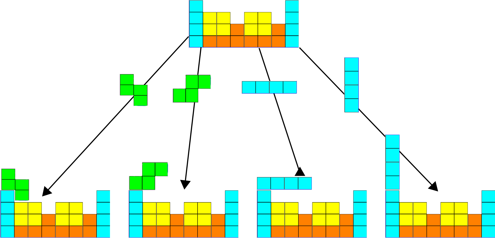
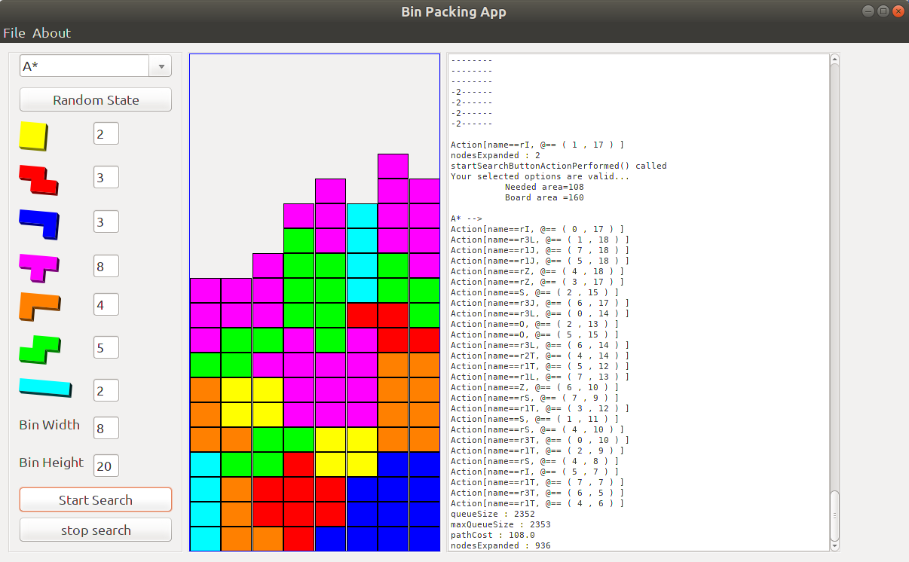

## Overview

Tree Search Implementations

###How can we use Tree Search Algorithms to figure out Tetris?
There are many great Generalized Tree Search Algorithms that can be used
to solve this problem!

In this application we'll implement:

- Depth First Search
- Bredth First Search
- Depth First Search
- Recursive DLS
- Iterative Deepening
- Simulated Annealing
- Hill Climbing
- A*
- Greedy Best First Search

###GUI Screenshot

###Running
To run the application just clone or download the zip and run
this in the command line:

`mvn install exec:java
`